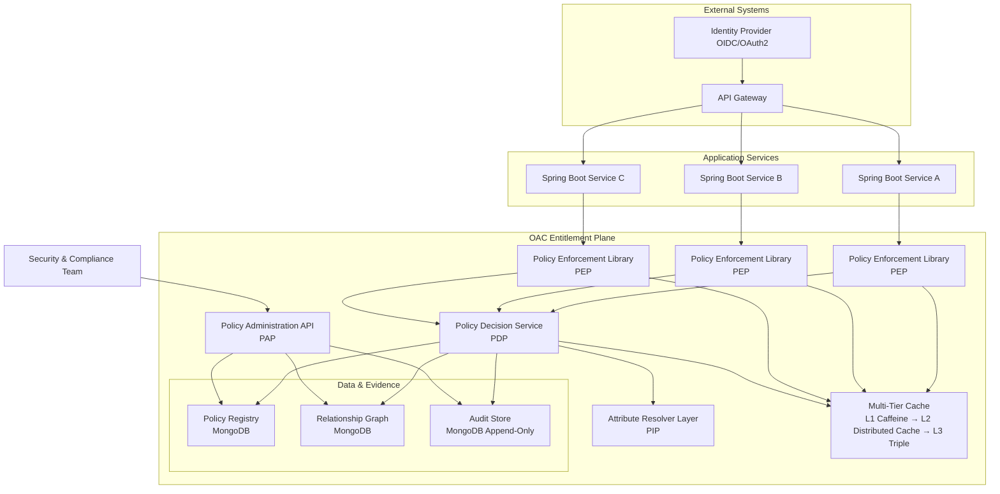
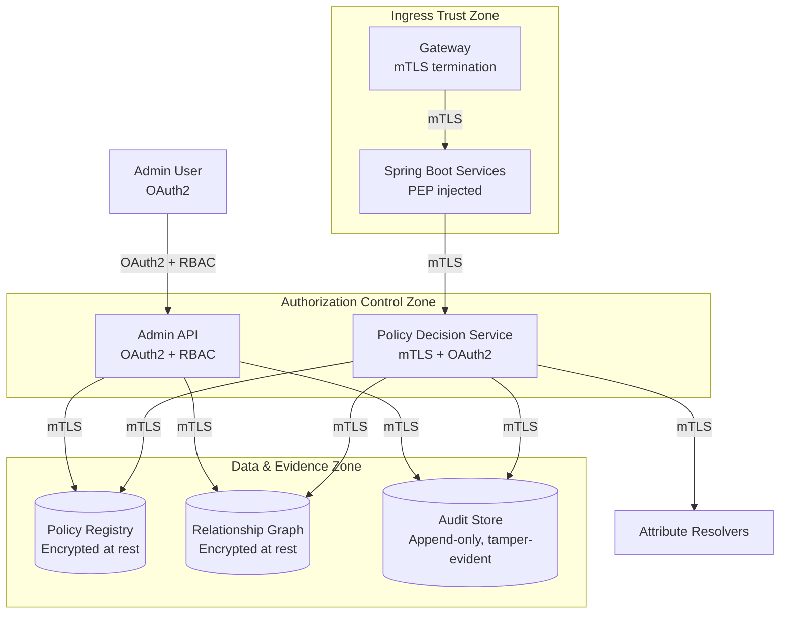
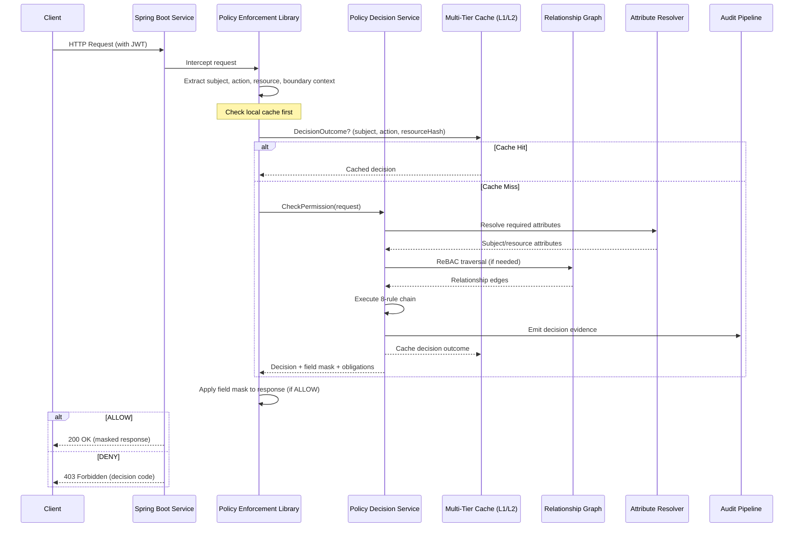
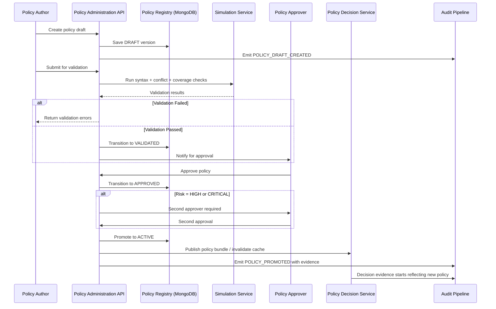

# Entitlement Engine: Architecture & Design Document

## 1. Document Overview & Context

### Document Status

**Draft / For Review**

### Target Audience

| Role | Focus Area |
|------|-----------|
| Enterprise Architects | System integration, deployment topology, scalability |
| Application Developers | SDK integration, API contracts, local development |
| Security Engineers | Threat model, trust boundaries, data privacy, audit |
| DevOps / Platform Engineers | Deployment, operational runbooks, observability |

### Objective

This document describes the architecture and design of the Orthogonal Access Control (OAC) Entitlement Engine. It seeks technical and security feedback on the proposed engine architecture, specifically regarding:

- **Policy evaluation latency** — achieving P95 < 5ms for common decision paths
- **Scalability** — supporting 10,000+ concurrent evaluations per PDP instance
- **Developer integration** — minimizing friction for Spring Boot microservice adoption

Reviewers are asked to validate trade-offs documented in Section 4 (Key Design Decisions) and confirm that the proposed evaluation paradigm meets the latency, availability, and consistency requirements of their respective domains.

### Document Versioning

| Version | Date | Author | Changes |
|---------|------|--------|---------|
| 0.1 | 2026-02-07 | CDMS Core Engineering Team | Initial draft for review |

### Required Reviewers

| Reviewer | Role | Review Area | Due Date |
|----------|------|-------------|----------|
| TBD | Security Architect | Threat model, trust boundaries, fail-closed strategy | TBD |
| TBD | Platform Architect | Deployment topology, caching, multi-region | TBD |
| TBD | Staff Engineer | SDK design, API contracts, developer experience | TBD |
| TBD | Compliance Lead | Audit trail, SOD, maker-checker governance | TBD |

---

## 2. Problem Statement

### 2.1 Business Problem

Enterprises operating Spring Boot microservices face compounding authorization challenges:

- **Authorization sprawl**: Each service duplicates permission logic, leading to inconsistent enforcement and vulnerabilities. A single policy change requires coordinated releases across multiple teams.
- **Compliance friction**: Auditors must inspect every service to verify controls. Separation-of-duties (SOD) violations are discovered weeks or months after the fact. Quarterly audits consume 4+ weeks and 6+ full-time employees.
- **Delivery bottlenecks**: Adding a new permission or role requires code changes, testing, and deployment in multiple services, slowing feature velocity by days or weeks per change.
- **Data leakage risk**: In-memory field-level filtering depends on every developer remembering to mask sensitive fields. Omissions lead to PII/PCI data leaks in API responses and logs.


### 2.2 Desired State

A centralized **Entitlement Engine** that:

1. Evaluates **any authorization question** in under 5ms (P95) for common paths, under 15ms (P99) for complex graph traversals.
2. Provides **field-level, column-level, and data-level** filtering — not just coarse allow/deny.
3. Enforces **5 orthogonal policy boundaries**: tenant, geography, market, line of business, and channel.
4. Supports **three authorization models** — RBAC (role-based), PBAC (policy-based), and ReBAC (relationship-based) — in a single decision pipeline with deterministic precedence.
5. Provides **governance workflows** with maker-checker, separation of duties, risk-graded approval gates, and full audit trails.
6. Offers **SDK integration** that adds zero-touch enforcement to Spring Boot services, with both annotation-driven and non-intrusive enforcement patterns.
7. Evolves from centralized PDP to **in-process evaluation** (sub-0.5ms) through compiled policy bundles for ultra-low-latency paths.

---

## 3. Scope & Use Cases

### 3.1 In Scope

| Category | Description |
|----------|-------------|
| Policy Decision Service | Central REST endpoint for `CheckPermission(subject, action, resource, context) -> {allow, fieldMask, obligations}` |
| Policy Administration API | CRUD for policies, boundaries, constraints, risk levels, and lifecycle management |
| Attribute-Based Access Control (ABAC) | Policies with SpEL conditions composed over subject, resource, action, and environment attributes |
| Policy Boundaries | 5 multi-dimensional scoping dimensions: tenant, geography, market, LOB, channel |
| Attribute-Level Filtering | Field mask generation (READ, MASK, NONE, DENY) per subject-resource pair |
| Relationship-Based Access Control (ReBAC) | Resource-to-resource relationships (owner, member, parent, delegate) with bounded traversal |
| Governance Workflow | Maker-checker, SOD rules, policy states (DRAFT → ACTIVE → DEPRECATED → RETIRED) |
| Audit Trail | Immutable log of all decision evaluations and policy mutations |
| Spring Boot SDK | One starter (`spring-policy-enforcement-starter`) with two enforcement modes: annotation-driven (`@RequireAccess`) and non-intrusive interceptor |
| Consistency Token | Etag-based optimistic concurrency for policy mutations and causal safety |
| Fail-Open / Fail-Closed | Configurable degradation behavior per protected endpoint |

### 3.2 Out of Scope

| Category | Reason |
|----------|--------|
| Authentication (AuthN) | Delegated to existing IdP (OIDC/OAuth2) |
| Identity Lifecycle Management | Managed by IGA system, not OAC |
| User Provisioning / Deprovisioning | Outside OAC control plane |
| Multi-Factor Authentication (MFA) | Handled at IdP level |
| Network-Level Authorization | Firewall / NAC responsibility |
| Encryption Key Management | Delegated to existing KMS |
| Non-Java SDKs (Phase 1) | Initial release targets Java Spring Boot ecosystem only |

### 3.3 Primary Use Cases

#### Use Case 1: User Accessing a Restricted API

```
Actor:      Authenticated user (subject)
Action:     Attempts to call GET /api/parties/{id}
Engine:     Intercepts request via Spring Boot interceptor,
            constructs CheckPermission(subject="user-1",
              action="READ", resource="Party:PTY-789",
              boundary={tenant, geography, ...}),
            evaluates policy chain
Required Result:
  ALLOW → Request proceeds, response filtered by field mask
  DENY  → HTTP 403 returned with explainable decision code
```

#### Use Case 2: Admin Delegating Role Permissions

```
Actor:      Tenant administrator
Action:     Creates a new policy with ALLOW effect,
            scoped to {tenant: "acme-corp", market: "retail"},
            targeting "party.read" permission for analyst role
Engine:     Policy created in DRAFT state.
            Maker-checker requires second admin to approve.
            On approval → Policy transitions to ACTIVE.
Required Result:
  Policy becomes effective within consistency window.
  Subsequent CheckPermission calls reflect new rule.
  Audit trail records author, approver, and all state transitions.
```

#### Use Case 3: Relationship-Based Resource Access

```
Actor:      Service user (subject: "alice")
Action:     Requests access to resource "document:DOC-456"
Engine:     No direct RBAC or PBAC policy matches.
            Evaluates ReBAC: "alice" is MEMBER of "team:engineering",
            and "team:engineering" OWNS "folder:reports",
            and "document:DOC-456" has PARENT "folder:reports".
            After 2-hop traversal → relationship found → ALLOW with caveat.
Required Result:
  Policy allows access with field-level caveats applied.
  Time-window caveat restricts access to business hours.
```

#### Use Case 4: Attribute-Conditional Access (Caveat Evaluation)

```
Actor:      Support agent (subject: "support-1")
Action:     Attempts to view customer PII data (field: customer.ssn)
Engine:     Policy matches: "support" role ALLOW "view" on "Customer" resource.
            Caveat evaluation: FieldMaskCaveat sets customer.ssn → MASK.
            Response includes attributeAccessMap: { "customer.ssn": "MASK" }.
Required Result:
  API response returns customer record with SSN masked as "***-***-1234".
  Agent sees enough to assist customer without PII exposure.
```

#### Use Case 5: Evaluate Permissions in Under 50ms at 10,000 TPS

```
Actor:      High-throughput API gateway
Action:     10,000 concurrent calls to CheckPermission
Engine:     PDP serves from Caffeine L1 cache (95%+ hit rate).
            Cache misses resolve via Distibuted Cache L2 → MongoDB in <5ms P95.
            Pipeline: stateless, horizontally auto-scaled.
Required Result:
  P95 latency ≤ 5ms for simple decisions.
  P99 latency ≤ 15ms for ReBAC traversals.
  No cascading failures during traffic spikes.
```

### 3.4 Quality Attributes

| Metric | Target | Measurement |
|--------|--------|-------------|
| Policy evaluation latency (P95, simple path) | **≤ 50ms** (end-to-end, including network) | Per-instance Micrometer timer |
| Decision latency (P95, simple path, server-side) | ≤ 5ms | Per-instance Micrometer timer |
| Decision latency (P99, ReBAC traversal) | ≤ 15ms | Per-instance Micrometer timer |
| Decision latency (P95, warm cached) | ≤ 1ms | Cache hit vs miss breakdown |
| Throughput | 20,000 decisions/sec per PDP instance | Load test |
| Concurrent evaluations | 10,000 per instance | Load test |
| Availability (decision endpoint) | 99.99% | SLO monitoring |
| Cache hit ratio (steady state) | > 95% | Micrometer cache metrics |
| Policy propagation (bundle push) | < 15s (OCI push to ClassLoader swap) | End-to-end timing |
| Stale cache TTL (fallback mode) | ≤ 30 seconds | Configuration |

### 3.5 Resource Model

Every resource in the system is identified by a `(type, id)` pair:

```
Resource ::= (resourceType: String, resourceId: String)
```

Boundary values (tenant, geography, market, line of business, channel) are resolved from the request's `boundaryContext` at decision time:

```java
// DecisionApplicationService.java
if (request.boundaryContext() != null) {
    resolvedRuntimeContext.putIfAbsent("resourceTenant", request.boundaryContext().tenant());
    resolvedRuntimeContext.putIfAbsent("resourceGeography", request.boundaryContext().geography());
    resolvedRuntimeContext.putIfAbsent("resourceMarket", request.boundaryContext().market());
    resolvedRuntimeContext.putIfAbsent("resourceLineOfBusiness", request.boundaryContext().lineOfBusiness());
    resolvedRuntimeContext.putIfAbsent("resourceChannel", request.boundaryContext().channel());
}
```

The `MissingBoundaryContextRule` and `BoundaryViolationRule` then compare these resolved values against policy-scoped boundaries.

No Resource Type Registry or centralized attribute schema exists in the current implementation. Attribute resolution is limited to the runtime context provided in the request.

---

## 4. Key Design Decisions & Trade-offs

This section documents architecturally significant decisions using the Architecture Decision Record (ADR) format.

---

### ADR-001: Authorization Model — Multi-Model Support

**Context**: The engine must support diverse authorization patterns across enterprise microservices: coarse-grained role-based access (RBAC), fine-grained attribute-based polices (PBAC), and relationship-driven access (ReBAC).

**Decision**: Adopt a unified decision pipeline that evaluates **RBAC + PBAC + Attribute-Assisted ReBAC** in a single precedence-ordered rule chain.

**Alternatives Considered**:

1. **RBAC-only** — Simplest model, insufficient for fine-grained or relationship-driven access. 300+ role explosion in current state is evidence of RBAC-only failure.
2. **PBAC-only** — Expressive but requires every relationship check to be encoded as an attribute predicate, increasing policy complexity and runtime attribute resolution cost.
3. **ReBAC-only (Zanzibar-style)** — Optimal for relationship-rich domains but requires all access to be modeled as graph tuples. Overkill for coarse-grained role assignments and adds latency for simple checks.
4. **Multi-model with unified pipeline** (selected) — Each model handles its natural domain. Precedence rules (Section 6.2) resolve conflicts deterministically.

**Consequences**:
- **Positive**: Authorization logic maps naturally to its best-fit model. Simple role checks stay simple. Complex relationship traversals use the graph path. No single model is forced to express everything.
- **Negative**: Rule chain has 8 steps. Developers must understand precedence. Policy authors must choose the right model for each rule.
- **Mitigation**: Decision explainability (decision codes, matched policy IDs, evidence refs) clarifies which model and rule produced each outcome.

---

### ADR-002: Evaluation Paradigm — Centralized PDP Evolving to Hybrid In-Process

**Context**: Policy evaluation can be centralized (PDP as a remote service) or distributed (evaluation runs in-process with cached policies). Each approach has latency, consistency, and operational trade-offs.

**Decision**: **Phase 1** — Centralized PDP over REST/gRPC (Architecture A). **Phase 2+** — Hybrid deployment where Java Policy Engine runs in-process for hot-path decisions (sub-0.5ms) while central PDP handles governance, complex evaluations, and policy distribution (Architecture D).

**Evaluation of Alternatives**:

| Dimension | Option A: Centralized PDP | Option B: In-Process (Hybrid) |
|-----------|--------------------------|-------------------------------|
| **Latency** | 1-5ms (local network) + evaluation time | 0.1-0.5ms (same process) |
| **Consistency** | Strong — always latest policies | Eventual — bounded by bundle push + Change Stream |
| **Operational complexity** | Simple — stateless PDP, client is thin SDK | Higher — policy compiler, bundle distribution, Change Stream watcher |
| **Failover** | PDP failure → fail-closed or stale cache | Triple cache survives PDP + DB outage |
| **Update propagation** | Immediate (next request hits updated PDP) | 5-15s (bundle push) or <100ms (Change Stream) |
| **Governance** | All decisions go through central PDP | Some decisions bypass PDP → audit must be attached at SDK |
| **Resource cost** | PDP cluster scales independently | Each application pod needs heap for compiled policies + caches |

**Rationale for Phased Approach**:
- Phase 1 delivers value quickly with simpler architecture. 5ms P95 is acceptable for most enterprise APIs.
- Phase 2+ targets ultra-low-latency paths (e.g., high-throughput internal APIs) where 5ms overhead per request is material.
- The hybrid model permits gradual adoption: services requiring <0.5ms deploy the Java Policy Engine; others continue with central PDP.

**Consequences**:
- **Phase 1 trade-off**: Simple architecture, fine for 5ms P95 target. Single point of failure for decisions (mitigated by multi-AZ PDP cluster + client-side caching).
- **Phase 2+ trade-off**: Added complexity in policy compilation, bundle signing/distribution, triple cache management, and differential testing between in-process and central PDP.
- **Migration path**: `DecisionClient` interface (currently REST) will accept a `JavaPolicyDecisionClient` implementation that falls back to gRPC central PDP on cache miss.

---

### ADR-003: Policy Language — JSON Document Schema over Domain-Specific Languages

**Context**: The engine needs a policy representation that can be authored by security administrators, validated programmatically, stored in MongoDB, and compiled to Java bytecode for in-process evaluation.

**Decision**: Use a **JSON document schema** with structured fields (effect, action, resourceType, boundaryContext, caveats, conditions) rather than adopting Rego (OPA), Cedar (AWS), or a custom DSL.

**Alternatives Evaluated**:

| Aspect | JSON Schema (selected) | Rego (OPA) | Cedar (AWS Verified Permissions) | Custom DSL |
|--------|----------------------|------------|----------------------------------|------------|
| **Schema validation** | JSON Schema, OpenAPI | Built-in `opa check` | Built-in validation | Must build |
| **MongoDB storage** | Native — policies are documents | String field | String field | String field |
| **Compilable to Java** | Trivial — JSON → POJO → compiled policy | OPA eval via Go SDK | Cedar Java SDK (alpha) | Must build compiler |
| **Tooling** | Any JSON editor | OPA REPL, VS Code | AWS console | Must build |
| **Expressiveness** | Structured + conditional JSON | Full Rego language | Cedar constraint language | Arbitrary |
| **Learning curve** | Low | Medium-high | Medium | High |

**Rationale**: JSON schema provides the lowest barrier to entry, native MongoDB storage, straightforward path to Java compilation, and sufficient expressiveness for the defined policy model. Where complex conditions are needed, JSON allows embedding of structured conditions (operator/value pairs) that the rule chain interprets.

**Consequences**:
- **Positive**: Any JSON editor is a policy authoring tool. Policies are directly queryable in MongoDB. OpenAPI contracts validate structure. Compilation to Java is a JSON-to-Java transformation.
- **Negative**: Less expressive than full Rego. Complex boolean logic requires nested condition structures.
- **Mitigation**: The 8-rule chain handles precedence, deny-override, and caveat evaluation structurally. Additional condition operators can be added without changing the schema.

---

### ADR-004: Storage Backend — MongoDB Document Model

**Context**: The engine requires storage for policies, relationship edges, audit records, and configuration. Options include relational (PostgreSQL), graph-native (Neo4j), or document (MongoDB).

**Decision**: **MongoDB 7.0** as the primary datastore for all persistence — policies, relationships, resource grants, audit events, and fail-open endpoint configuration.

**Alternatives Evaluated**:

| Aspect | MongoDB (selected) | PostgreSQL | Neo4j / SpiceDB |
|--------|-------------------|------------|-----------------|
| **Policy storage** | Native document model | JSONB columns | Not designed for document storage |
| **Relationship traversal** | Aggregation pipeline ($graphLookup, max depth 20) | Recursive CTEs | Native graph traversal (ideal for deep ReBAC) |
| **Audit storage** | Append-only capped collections, TTL indexes | Append-only tables | Not designed for audit |
| **Schema flexibility** | Schema-on-read (policies may have variant structures) | Schema-on-write (migrations needed) | Fixed schema |
| **Change Streams** | Native CDC for cache invalidation | Logical replication (pgoutput) | Not available |
| **Operations complexity** | Single database, one backup/restore plan | Single database | Additional graph database + operational burden |
| **Maturity for ReBAC** | Edge traversal via $graphLookup (bounded depth) | Recursive CTEs (bounded depth) | Native — designed for Zanzibar-style |

**Rationale**: MongoDB provides the best balance of operational simplicity (single datastore), schema flexibility (policy structures evolve), native Change Streams (real-time cache invalidation), and sufficient ReBAC capability ($graphLookup up to depth 20). Phase 1 ABAC/PBAC decisions don't use graph traversals. Phase 2+ ReBAC traversals are bounded to depth 5 (well within MongoDB's capability).

**Consequences**:
- **Positive**: One database to operate. Change Streams enable cache invalidation without additional infrastructure. Flexible schema accommodates policy evolution.
- **Negative**: Deep relationship traversals (>5 hops) may exceed the 15ms P99 target. Not optimized for Zanzibar-style graph workloads.
- **Mitigation**: ReBAC depth is configurable (max 5 hops). Performance-critical paths use in-memory adjacency list (built from MongoDB on startup). Graph-native store remains a future option if ReBAC complexity demands it.

---

## 5. System Architecture & Design Proposals

### 5.1 High-Level Topology



### 5.2 Trust & Security Boundaries



**Security Controls**:
- **Mutual TLS (mTLS)** on all service-to-service communication
- **OAuth2 + RBAC** on admin API endpoints
- **Encryption at rest** for MongoDB collections (policies, relationships, audit)
- **Encryption in transit** (TLS 1.3) for all data plane traffic
- **Append-only audit store** — tamper-evident via hash chains or immutable log semantics
- **Input validation** on all API inputs (OpenAPI-generated validation + Jakarta Bean Validation)
- **Rate limiting** per client on decision endpoint

### 5.3 Core Components

| Component | Acronym | Responsibility |
|-----------|---------|---------------|
| **Policy Enforcement Point** | PEP | Intercepts protected requests via Spring Boot interceptor/filter, extracts subject/action/resource/context, calls PDP or local cache, enforces decision |
| **Policy Decision Point** | PDP | Stateless rule evaluation engine. Executes 8-rule chain (Section 6.2), evaluates caveats, returns decision + field mask + obligations |
| **Policy Administration Point** | PAP | CRUD APIs for policy lifecycle. Enforces maker-checker, SOD, approval gates. Manages state transitions: DRAFT → VALIDATED → APPROVED → STAGED → ACTIVE |
| **Policy Information Point** | PIP | Resolves subject attributes (from JWT/OIDC claims, identity directory), resource attributes (from domain services), and environment attributes (request metadata) |
| **Policy Registry** | — | MongoDB collection for policy documents with version history, state, boundaries, and ownership metadata. |
| **Relationship Graph** | — | MongoDB collection for ReBAC relationship edges. Supports BFS traversal up to configurable depth. In-memory adjacency list for hot-path |
| **Audit Pipeline** | — | Append-only event stream for decisions and policy mutations. Event-sourced for full reconstruction |

### 5.4 Data Flow — CheckPermission



### 5.5 Data Flow — Policy Administration & Governance



---

## 6. Entitlement Policies & Rules

### 6.1 Policy Language & Schema

Policies are defined as JSON documents stored in the MongoDB `policies` collection. The schema supports structured conditions, boundary scoping, caveat definitions, and lifecycle metadata.

**Core Policy Document Schema**:

```json
{
  "name": "POL.RETAIL.PARTY.READ.ALLOW.v1",
  "version": "v1",
  "state": "ACTIVE",
  "effect": "ALLOW",
  "action": "read",
  "resourceType": "party",
  "subjectId": null,
  "subjectRole": "analyst",
  "priority": 100,
  "boundaryContext": {
    "tenant": "tenant-a",
    "geography": "us",
    "market": "retail",
    "lineOfBusiness": "cards",
    "channel": "staff"
  },
  "conditions": {
    "timeWindow": {
      "start": "06:00",
      "end": "22:00",
      "timezone": "America/New_York"
    }
  },
  "caveats": {
    "fieldMask": {
      "fields": {
        "customer.ssn": "MASK",
        "customer.email": "MASK",
        "party.total": "READ"
      },
      "tags": {
        "PII": "MASK"
      }
    }
  },
  "riskLevel": "MEDIUM",
  "owner": "payments-platform-team",
  "author": "alice",
  "certification": {
    "lastCertified": "2026-01-15T00:00:00Z",
    "nextCertification": "2026-07-15T00:00:00Z",
    "certificationStatus": "CERTIFIED"
  }
}
```

### 6.1.1 Condition Expressions (SpEL)

Policy conditions are written as **Spring Expression Language (SpEL)** strings, not JSON operator trees. A policy stores its condition in the `spelCondition` field and evaluates it via `SpelConditionEvaluatorAdapter` at rule priority 5 (`SpelConditionRule`).

**Binding context:**

| Object | Exposed Properties | Source |
|--------|-------------------|--------|
| `subject` | `id`, `type`, `department`, `market`, `lob`, `geography`, `channel`, `tenant`, `clearance` | Request subject + boundary context |
| `resource` | `id`, `type`, `market`, `lob`, `geography`, `channel`, `tenant`, `requesterId` | Request resource + runtime context |
| `environment` | `hour`, `riskScore`, `currentHour` + any `runtimeContext` key | Request runtime context |

**Expression examples:**

```spel
// Separation of duties — approver cannot self-approve
subject.id != resource.requesterId

// Department-based access (ABAC)
subject.department == 'hr'

// Time-window condition
environment.hour >= 9 && environment.hour < 17

// Risk-based condition
environment.riskScore <= 100
```

**When a condition fails:**
- If the SpEL expression returns `false`, `SpelConditionRule` returns `DECISION` with code `SPEL_CONDITION_FAILED`.
- If evaluation throws an exception, the rule returns `SPEL_EVALUATION_ERROR`.
- Both outcomes produce DENY.

**Why SpEL:** Ships with every Spring Boot application, no additional dependency, expression compilation is cached via `ConcurrentHashMap`, and Spring ecosystems teams are already familiar with the syntax.

### 6.2 Decision Rule Chain (8-Rule Precedence)

The engine evaluates 8 rules in strict priority order. Higher-priority rules short-circuit evaluation:

| Priority | Rule | Decision Code | Behavior |
|----------|------|---------------|----------|
| **1** (highest) | `ExplicitDenyRule` | `DECISION_EXPLICIT_DENY` | Policy with effect=DENY matches → immediate DENY |
| **2** | `MissingBoundaryContextRule` | `DECISION_MISSING_BOUNDARY_CONTEXT` | Required boundary fields missing in request → DENY |
| **3** | `BoundaryViolationRule` | `DECISION_BOUNDARY_DENY` | Request boundaries don't match resource boundaries → DENY |
| **4** | `DependencyOutageRule` | `DECISION_DEPENDENCY_UNAVAILABLE` / `DECISION_FAIL_OPEN_ALLOWED` | Downstream dependency unavailable → fail closed or open per endpoint config |
| **5** | `ConsistencyTokenRule` | `CONSISTENCY_VIOLATION` / `DECISION_CONSISTENCY_TOKEN_REQUIRED` | Stale or mismatched consistency token → DENY or require retry |
| **6** | `ReBacRelationshipRule` | `DECISION_REBAC_NO_RELATIONSHIP` | Relationship graph traversal → ALLOW if path found, DENY if no path |
| **7** | `AllowRule` | `DECISION_POLICY_ALLOW` / `DECISION_POLICY_ALLOW_WITH_CAVEATS` / `DECISION_CAVEAT_FAILED` | Policy with effect=ALLOW matches → evaluate caveats → ALLOW or caveat-enriched |
| **8** (lowest) | `DefaultDenyRule` | `DECISION_DEFAULT_DENY` | No policy matched → DENY (deny-by-default) |

**Precedence Rules**:
1. **Explicit DENY** always overrides ALLOW (deny-override)
2. **Boundary violations** cannot be overridden by any lower rule
3. **Caveats** can downgrade ALLOW to DENY (e.g., time window expired)
4. **Default is DENY** — no match means deny
5. **Consistency token mismatch** forces re-read if strict consistency is requested

**Intra-Tier Composition Rules**:

Within a given priority tier (rules 6 and 7 can have multiple matching policies), conflicts are resolved as follows:

| Scenario | Resolution Rule |
|----------|-----------------|
| Multiple ALLOW policies match, same priority tier | **Most-specific-wins**: The policy with the greatest number of matching non-wildcard fields (`subjectId`, `subjectRole`, `conditions`) is selected. If tied, the policy with the highest numeric `priority` field value wins. If still tied, the policy with the earliest `createdAt` timestamp wins. |
| Multiple DENY policies match, same priority tier | Any matching DENY at Rule 1 (`ExplicitDenyRule`) produces DENY. The first policy evaluated (by highest `priority`, then earliest `createdAt`) provides the decision code. |
| ReBAC multiple relationship paths (Rule 6) | The shortest relationship path (fewest hops) is used. If multiple paths have the same length, the path with the highest aggregate edge confidence score is selected. If still tied, ALLOW is returned. |
| Caveat partial failure (Rule 7) | Caveats are evaluated independently per policy. If the selected ALLOW policy has a caveat that evaluates to FAIL, the engine falls back to the next matching ALLOW policy (if any) within the same tier. If no ALLOW policy passes caveat evaluation, the decision proceeds to Rule 8 (`DefaultDenyRule`). |

**Example — Multiple ALLOW policies with intra-tier composition**:

```json
[
  { "subjectRole": "analyst", "resourceType": "party", "effect": "ALLOW", "priority": 100 },
  { "subjectRole": "analyst", "resourceType": "party", "effect": "ALLOW", "priority": 200, "conditions": { "timeWindow": { ... } } }
]
```

Both policies match `subjectRole=analyst` on `resourceType=party`. The second policy has `priority=200` (higher) and adds a time-window condition, making it more specific. It is selected for evaluation. If its caveat fails, the first policy (`priority=100`) becomes the fallback within the same tier.

### 6.3 Caveat Evaluators

Caveats add runtime attribute conditions that modify or enrich a decision without changing the binary allow/deny outcome:

| Caveat Type | ID | Parameters | Evaluation Mode | Effect |
|-------------|-----|------------|-----------------|--------|
| Time Window | `TIME_WINDOW` | `start`, `end` (ISO 8601), `timezone` | Synchronous (hot path) | ALLOW only if request time falls within window |
| Source IP Range | `SOURCE_IP_RANGE` | `cidr` block, `allowedRanges[]` | Synchronous (hot path) | ALLOW only if client IP is within permitted ranges |
| Field Mask | `FIELD_MASK` | `fields{}`, `tags{}`, `mask[]`, `hidden[]` | Asynchronous (off critical path in Phase 2+) | Enriches response with field-level access map; never denies |

#### Attribute-Based Access Control (ABAC)

ABAC conditions are expressed as SpEL expressions on the `spelCondition` field. The `SpelConditionRule` evaluates them at priority 5 in the rule chain. If the condition evaluates to `false`, the decision is DENY with code `SPEL_CONDITION_FAILED`.

#### Relationship-Based Access Control (ReBAC)

Access derives from graph relationships between subjects and resources. Relationships are stored as edges in the MongoDB `relationships` collection and traversed via `MongoRelationshipGraphAdapter` bounded BFS up to 3 hops.

- A policy with `requiredRelationship: "manages"` grants access only if a path exists where each edge is of type "manages" from any traversed node to the target resource.
- Intermediate hops in the chain can use any relationship type. Only the direct edge from the original source to the target is type-filtered.
- Expired edges (`expiresAt` in the past) are skipped during traversal.
- The `ReBacRelationshipRule` evaluates at priority 6. If no path exists, the decision is DENY with code `DECISION_REBAC_NO_RELATIONSHIP`.

### 6.4 Field-Level Access Control

The engine computes a per-subject, per-resource field mask. Access levels defined in `AttributeAccessLevel.java`: `READ`, `MASK`, `NONE`, `DENY`.

**Access Level Resolution Order**:
1. Field-level ACL (explicit field path → access level in `fieldAccess` map) — highest priority
2. Tag-based classification (prefix/substring pattern → access level in `tagAccess` map)
3. Default: READ

**Mask Behavior**:

| Access Level | Effect on Response Body |
|-------------|------------------------|
| `READ` | Field visible with full value |
| `MASK` | Field value replaced with mask pattern (e.g., `***-**-1234`) |
| `NONE` | Field removed entirely from response body |
| `DENY` | Forbidden at field level; analogous to NONE |

---

## 7. Interfaces, APIs, & Developer Experience

### 7.1 Decision API

**Endpoint**: `POST /v1/decisions/check-permission`

**Request**:
```json
{
  "subject": {
    "type": "human",
    "id": "user-123"
  },
  "action": "READ",
  "resource": {
    "type": "party",
    "id": "PTY-789"
  },
  "boundaryContext": {
    "tenant": "acme-corp",
    "geography": "EU",
    "market": "enterprise",
    "lineOfBusiness": "supply-chain",
    "channel": "staff"
  },
  "runtimeContext": {
    "sourceIp": "10.0.0.55",
    "requestTime": "2026-06-25T08:30:00Z"
  },
  "consistencyToken": "ct-abc-123",
  "requestId": "550e8400-e29b-41d4-a716-446655440000"
}
```

**Response** (ALLOW with field mask):
```json
{
  "decision": "ALLOW",
  "decisionCode": "ALLOW_WITH_CAVEATS",
  "matchedPolicies": ["POL.RETAIL.PARTY.READ.ALLOW.v1"],
  "attributeAccessMap": {
    "customer.email": "MASK",
    "customer.ssn": "NONE",
    "party.total": "READ"
  },
  "obligations": [
    {
      "type": "FIELD_MASK",
      "fields": ["customer.email"],
      "maskPattern": "****@****.***"
    }
  ],
  "explanationRefs": ["evidence://decision/policy-allow-caveats"],
  "evaluatedAt": "2026-06-25T08:30:00.123Z",
  "consistencyToken": "ct-abc-124"
}
```

**Response** (DENY):
```json
{
  "decision": "DENY",
  "decisionCode": "DECISION_BOUNDARY_DENY",
  "matchedPolicies": [],
  "explanationRefs": ["evidence://decision/boundary-deny"],
  "evaluatedAt": "2026-06-25T08:30:00.123Z"
}
```

**Additional endpoints**:

| Method | Path | Description |
|--------|------|-------------|
| POST | `/v1/decisions/check-permission` | Single authorization decision |
| POST | `/v1/decisions/lookup-resources` | Discover authorized resources for a subject |

**LookupResources Request**:
```json
{
  "subject": { "type": "human", "id": "user-123" },
  "action": "READ",
  "resourceType": "party",
  "boundaryContext": {
    "tenant": "acme-corp",
    "geography": "EU",
    "market": "enterprise",
    "lineOfBusiness": "supply-chain",
    "channel": "staff"
  }
}
```

**LookupResources Response**:
```json
{
  "resourceIds": ["PTY-789", "PTY-790", "PTY-791"],
  "nextPageToken": "cursor-v2"
}
```

### 7.2 Admin API

| Method | Path | Description |
|--------|------|-------------|
| POST | `/v1/admin/policies` | Create policy draft |
| POST | `/v1/admin/policies/{id}/promote` | Promote policy through lifecycle states |
| GET | `/v1/admin/audit-events` | Query audit trail |
| GET | `/v1/admin/recovery/continuity` | Verify DR continuity |

**Create Policy Request**:
```json
{
  "name": "POL.RETAIL.PARTY.READ.ALLOW.v2",
  "effect": "ALLOW",
  "owner": "payments-platform-team",
  "author": "alice",
  "riskLevel": "MEDIUM",
  "definition": "{ ... }"
}
```

**Promote Policy Request**:
```json
{
  "targetState": "APPROVED",
  "approvers": ["bob"],
  "simulationCoverage": 92,
  "changeRationale": "Grant read access to party analysts in retail market",
  "rollbackReference": "v1"
}
```

### 7.3 Spring Boot SDK Integration

The OAC platform provides a single SDK (`spring-policy-enforcement-starter`) that supports two deployment modes for Spring Boot services:

#### Mode 1: Annotation-Driven Enforcement (`@RequireAccess`)

```java
@RestController
public class PartyController {

    @RequireAccess(action = "READ", resourceType = "Party")
    @GetMapping("/api/parties/{id}")
    public Party getParty(@PathVariable String id) {
        return partyService.findById(id);
    }

    @RequireAccess(action = "DELETE", resourceType = "Party")
    @DeleteMapping("/api/parties/{id}")
    public void deleteParty(@PathVariable String id) {
        partyService.delete(id);
    }
}
```

- **SDK**: `spring-policy-enforcement-starter`
- **Mechanism**: AOP aspect intercepts controller methods, constructs `CheckPermissionRequest` from method metadata and Spring Security principal, calls PDP (or local cache), throws `AccessDeniedException` on DENY
- **Supports**: `enforceFieldMask`, `failOpen`, `consistencyRequired`, and `gRPC` attributes

#### Mode 2: Non-Intrusive Enforcement (Interceptor + Registry)

```java
@Configuration
public class WebMvcConfig implements WebMvcConfigurer {
    
    @Override
    public void addInterceptors(InterceptorRegistry registry) {
        registry.addInterceptor(oacEnforcementInterceptor())
            .addPathPatterns("/api/**");
    }
}
```

- **SDK**: `spring-policy-enforcement-starter` (same artifact)
- **Mechanism**: `HandlerInterceptor` intercepts all matching requests, extracts endpoint-to-entitlement mappings from `EntitlementRegistry` (parsed from OpenAPI `x-oac-entitlement` vendor extensions at startup), calls PDP, applies field masks via `FieldMaskResponseAdvice`
- **Configuration** (`application.yml`):
  ```yaml
  oac:
    enforcement:
      contract-paths:
        - classpath:order-service-api.yaml
      identity:
        user-header: X-User-Id
        service-header: X-Service-Id
      fail-closed: true
  ```
- **Use case**: Teams that cannot modify controller code or want centralized enforcement without per-method annotations. Entitlements are declared declaratively in the OpenAPI contract.
- **No duplicate starters**: The legacy `spring-oac-clientkit-starter` has been consolidated into `spring-policy-enforcement-starter`. All projects should depend on the single artifact.

### 7.4 Local Development

```yaml
# application.yml (local profile)
oac:
  enforcement:
    mode: local           # Use in-process PDP (no network call)
    local-policy-path: classpath:sample-policies.json
    fail-on-error: false  # Allow development without PDP running
```

- In-process PDP loads policies from local JSON/YAML files
- Same policy syntax as production engine
- `@RequireAccess` annotation behaves identically
- No dependency on MongoDB or central PDP during development
- Seamless switch to remote PDP via config: `oac.enforcement.mode: remote`

---

## 8. Non-Functional Requirements & Security

### 8.1 Performance & Caching

No caching layer exists in the current implementation. Every decision reads from MongoDB. Multi-tier caching (Caffeine L1 → Distributed L2 → Compiled ClassLoader L3) is planned for Sprint 9+ in the implementation roadmap.

**Baseline latency targets** (without caching):
- Simple ABAC: P95 < 5ms (server-side)
- ReBAC traversal (3 hops): P95 < 15ms

### 8.2 Data Privacy & Compliance

| Requirement | Implementation |
|-------------|---------------|
| PII masking in logs | `AttributeAccessMap` marks PII/PCI fields. Audit pipeline never logs field values for tagged fields. Opaque references stored instead |
| Encrypted transport | TLS 1.3 for all service-to-service, service-to-database, and service-to-cache communication |
| Encryption at rest | MongoDB encrypted storage engine (or application-level field encryption for sensitive policy attributes) |
| PII classification | Tag-based classification with configurable patterns (`pii-classification.yml` or MongoDB collection). Resolved at decision time before logging. |
| Data residency | Boundary dimensions (tenant, geography) enable data segregation. Policies and audit records scoped by tenant. Future: per-geography MongoDB deployments |
| Minimal attribute retention | Decision logs store attribute evidence references (opaque URIs) rather than raw attribute values where feasible |

### 8.3 Auditability & Logging

**What Is Audited:**

| Event Type | Content | Storage |
|-----------|---------|---------|
| Decision evaluations | Subject ID, action, resource, boundary context, decision, decision code, matched policy IDs, evidence refs, timestamp | Append-only MongoDB `audit_events` collection |
| Policy mutations | Who changed what, old state, new state, before/after diff, approval evidence, timestamp | Append-only MongoDB `audit_events` collection |
| Policy lifecycle | State transitions with approver identities, risk level, simulation coverage | Append-only MongoDB `audit_events` collection |
| Admin actions | PAP operations with actor identity, idempotency keys | Append-only MongoDB `audit_events` collection |

**Audit Record Example**:
```json
{
  "eventId": "evt-001",
  "eventType": "DECISION_EVALUATED",
  "entityType": "DECISION",
  "entityId": "req-550e8400",
  "actor": "user-123",
  "decisionCode": "ALLOW_WITH_CAVEATS",
  "evidenceRef": "evidence://decision/policy-allow-caveats/evt-001",
  "severity": "INFO",
  "occurredAt": "2026-06-25T08:30:00.123Z",
  "metadata": {
    "action": "READ",
    "resourceType": "party",
    "resourceId": "PTY-789",
    "boundaries": {
      "tenant": "acme-corp",
      "geography": "EU"
    },
    "matchedPolicies": ["POL.RETAIL.PARTY.READ.ALLOW.v1"],
    "policyVersion": 3,
    "caveatContext": {
      "timeWindow": "evaluated",
      "fieldMask": "applied"
    }
  }
}
```

### 8.4 High Availability & Fallback Mechanisms

**Availability Target**: 99.99% (decision endpoint)

**Failure Mode Matrix**:

| Failure | Behavior | Strategy |
|---------|----------|----------|
| PDP instance failure | Application routes to healthy PDP instance | Multi-AZ deployment, load balancer health checks |
| PDP cluster unavailable | Client-side fail-closed or fail-open per endpoint classification | Configurable per endpoint via `fail-open-endpoints.properties` (or MongoDB collection in Phase 2+) |
| MongoDB primary down | PDP reads from L1/L2 cache. Writes queue | Circuit breaker on MongoDB adapter. Stale cache serves decisions within TTL |
| Network partition | Last-knowledge-good policy bundle serves decisions | Signed policy bundles deployed ahead of time. Client `DecisionClient` holds cached policies |
| Attribute resolver timeout | PDP proceeds without attribute (if optional) or DENY | Configurable attribute resolution SLOs. Circuit breaker per downstream PIP |
| Policy bundle propagation delay | In-process Java Engine serves previous bundle until new one is loaded | Atomic ClassLoader swap. Previous N bundles retained for instant rollback |

**Endpoint Classification**:
```properties
# fail-open-endpoints.properties
# Format: endpointKey=class
GET:/api/public/status=FAIL_OPEN
GET:/api/parties/=FAIL_CLOSED
POST:/api/parties/=FAIL_CLOSED
```

- **FAIL_OPEN**: Allow access during PDP outage (with audit warning)
- **FAIL_CLOSED**: Deny access during PDP outage (safe default)
- Unclassified endpoints default to FAIL_CLOSED

### 8.5 Security Controls

| Control | Implementation |
|---------|---------------|
| Mutual authentication | mTLS for all service-to-service communication within OAC plane |
| Admin authentication | OAuth2 with OIDC, role-based access to PAP operations |
| Input validation | OpenAPI-generated validation + Jakarta Bean Validation on all API inputs |
| Rate limiting | Per-client rate limiting on decision endpoint (configurable via admin API) |
| Audit integrity | Append-only storage prevents tampering. Hash-chain continuity for evidence reconstruction |
| Secrets rotation | Keys and secrets rotatable without service interruption |
| Tenant isolation | Boundary enforcement ensures cross-tenant access requires explicit policy + auditable justification. Boundary values are resolved from the request's `boundaryContext` at decision time (see Section 3.5). |
| Deny-by-default | No implicit allow. Every decision requires a matching policy |

---

## 9. Rollout Strategy & Deployment

### 9.1 Phased Delivery Roadmap

| Phase | Capabilities | Dependencies |
|-------|-------------|-------------|
| **1: Foundation** | Central REST PDP, ABAC, boundary enforcement, Spring Boot SDKs, maker-checker governance, audit trail | MongoDB 7.0, Docker Compose |
| **2: Advanced Auth** | ReBAC (SpiceDB integration or MongoDB traversal), field-level access control, policy simulation, delegated admin, causal consistency | Phase 1 foundation |
| **3: Enterprise Scale** | In-process Java Policy Engine (sub-0.5ms), policy compiler, triple cache, governance console UI, multi-region HA, SLO dashboards | Phase 2 ReBAC + field masks |

### 9.2 Deployment Topology

**Phase 1 Deployment** (Current):

```
┌──────────────────┐     ┌──────────────────┐     ┌──────────────────┐
│  Spring Boot     │     │  Spring Boot     │     │  Spring Boot     │
│  Service A       │     │  Service B       │     │  Service C       │
│  PEP (SDK) ──────┼─────┼──PEP (SDK) ──────┼─────┼──PEP (SDK)       │
└────────┬─────────┘     └────────┬─────────┘     └────────┬─────────┘
         │                        │                        │
         └────────────────────────┼────────────────────────┘
                                  │ HTTP / gRPC
                         ┌────────▼──────────────────┐
                         │  PDP Cluster              │
                         │  (3+ replicas)            │
                         │  ├── L1 Caffeine          │
                         │  └── L2 Distribyted Cache │
                         └────────┬──────────────────┘
                                  │
                         ┌────────▼─────────┐
                         │  MongoDB 7.0     │
                         │  ├── policies    │
                         │  ├── relations   │
                         │  └── audit       │
                         └──────────────────┘
```

**Phase 3+ Deployment** (Mature):

```
┌──────────────────────────────────────────────────┐
│  Spring Boot Service                              │
│  ┌────────────────────────────────────────────┐   │
│  │  PEP + Java Policy Engine (In-Process)     │   │
│  │  ├── Compiled Policy ClassLoader            │   │
│  │  ├── In-Memory Relationship Adjacency List  │   │
│  │  ├── FieldMaskResolver                      │   │
│  │  └── Change Stream Watcher (cache refresh)   │   │
│  └────────────────────┬───────────────────────┘   │
│                       │                            │
│  Cache miss → gRPC fallback to central PDP         │
└──────────────────────┬────────────────────────────┘
                       │
              ┌────────▼─────────┐
              │  PDP Cluster     │
              │  (Governance +   │
              │   Complex Eval)  │
              └────────┬─────────┘
                       │
              ┌────────▼─────────┐
              │  MongoDB 7.0     │
              │  (Source of Truth)│
              └──────────────────┘
```

### 9.3 Migration Strategy

**Step 1: Seed existing entitlements**
- Export existing role-permission mappings (from Spring Security config, hard-coded checks, database tables) to OAC policy JSON format
- Validate parity: run existing test suites against both old and new authorization paths
- Deploy OAC PDP in shadow mode (log decisions, do not enforce) for 2+ weeks to gather comparison data

**Step 2: Gradual adoption (per-service)**
- Onboard one service at a time, starting with non-critical read endpoints
- Add `@RequireAccess` or non-intrusive interceptor; test in staging
- Monitor for false denies (policy gap) and false allows (policy over-permission)
- Approve through maker-checker before production

**Step 3: Governance enablement**
- Configure policy certification cadence (90/180/365 days based on risk)
- Onboard policy owners and approvers
- Enable SOD enforcement at promotion time

**Step 4: Advanced features rollout**
- Enable ReBAC once relationship edges are seeded from existing access control lists
- Deploy field-level masking with PII tag classification
- Enable in-process Java Engine for services requiring sub-0.5ms latency

### 9.4 Testing Strategy

**Testing Pyramid**:

```
                 ╱╲
                ╱  ╲          E2E: Full service integration
               ╱    ╲         with Docker + Testcontainers MongoDB
              ╱ E2E  ╲        (3 test suites)
             ╱────────╲
            ╱          ╲
           ╱    BDD     ╲     BDD: Business behavior specifications
          ╱              ╲     Cucumber JVM + Spring (32 scenarios)
         ╱────────────────╲
        ╱                  ╲
       ╱   Architecture     ╲    ArchUnit: Package structure, hexagonal layering
      ╱                      ╲     dependency rules, annotation convention
     ╱────────────────────────╲
    ╱                          ╲
   ╱                            ╲    Unit: Isolated service/domain logic
  ╱                              ╲   JUnit 5 + Mockito (metrics, adapters)
 ╱                                ╲
╱                                  ╲
```

| Test Level | Scope | Technology | Execution Trigger |
|-----------|-------|-----------|------------------|
| **BDD (Cucumber)** | Business behavior via HTTP API | Cucumber JVM, Testcontainers MongoDB | `mvn test` |
| **E2E** | Full authorization flow | Spring Boot Test, Docker | `mvn test -Dcucumber.filter.tags="@e2e"` |
| **Architecture** | Package dependency rules | ArchUnit | `mvn test` |
| **Unit** | Service/domain logic isolation | JUnit 5 + Mockito | `mvn test` |
| **Differential** | Java Engine vs Central PDP parity | Custom test harness (Phase 3) | Pre-release CI gate |

**BDD Feature Coverage (69 Scenarios)**:

| Feature | Scenarios | Coverage |
|---------|-----------|----------|
| Policy decision evaluation | 12 | Allow, deny, boundary, precedence, caveats |
| ReBAC relationship checks | 6 | Direct, 2-hop, 3-hop, missing relationship |
| Policy administration | 8 | CRUD, lifecycle, maker-checker, SOD |
| Consistency and token validation | 6 | Causal safety, stale state, strict mode, unknown token, missing path |
| Governance and ABAC | 16 | Attribute resolution, time-window, risk score, break-glass |
| Hierarchical ReBAC | 4 | Organization chart, direct report, multi-role |
| Multi-tenancy isolation | 7 | Tenant, geography, LOB, channel boundaries |
| Separation of duties | 2 | Approver self-approval, different requester |

**Coverage Targets**:
- **Line coverage** (main source): 100% (enforced by JaCoCo)
- **Branch coverage** (main source): 95%
- **Class coverage** (main source): 0 missed

---

## Appendix A: Glossary

| Term | Definition |
|------|-----------|
| **ABAC** | Attribute-Based Access Control — policies composed over subject/resource/action/environment attributes |
| **PAP** | Policy Administration Point — UI/API for authoring and managing policies |
| **PBAC** | Policy-Based Access Control — centralized rule evaluation using structured policies |
| **PDP** | Policy Decision Point — the evaluation engine that executes the rule chain |
| **PEP** | Policy Enforcement Point — SDK interceptors that enforce decisions |
| **PIP** | Policy Information Point — attribute resolvers that supply context data |
| **RBAC** | Role-Based Access Control — access granted through role assignments |
| **ReBAC** | Relationship-Based Access Control — access derived from subject-resource graph relationships |
| **SOD** | Separation of Duties — control principle preventing conflicting assignments |
| **Consistency Token** | Etag-like token for causal consistency guarantees on critical read-after-write paths |

## Appendix B: References

| Document | Location | Description |
|----------|----------|-------------|
| PRD.md | `/PRD.md` | Product Requirements Document |
| ARCHITECTURE.md | `/ARCHITECTURE.md` | Architecture Specification |
| IMPLEMENTATION_PLAN.md | `/IMPLEMENTATION_PLAN.md` | Implementation roadmap and sprint guide |
| CONFIGURATION.md | `/CONFIGURATION.md` | MongoDB, ReBAC, and caveat configuration |
| Decision API Contract | `/contracts/decision-api.yaml` | OpenAPI 3.1 specification for decision endpoints |
| Admin API Contract | `/contracts/admin-api.yaml` | OpenAPI 3.1 specification for policy administration |
| Architecture Comparison | `/docs/Comparison Matrix.md` | Trade-off analysis of 4 candidate architectures |

---

*Document Version: 0.1 | Status: Draft / For Review | Author: OAC Architecture Team*